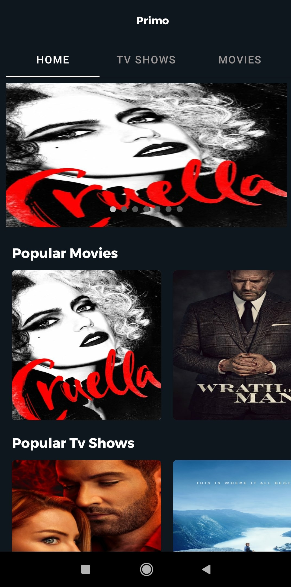
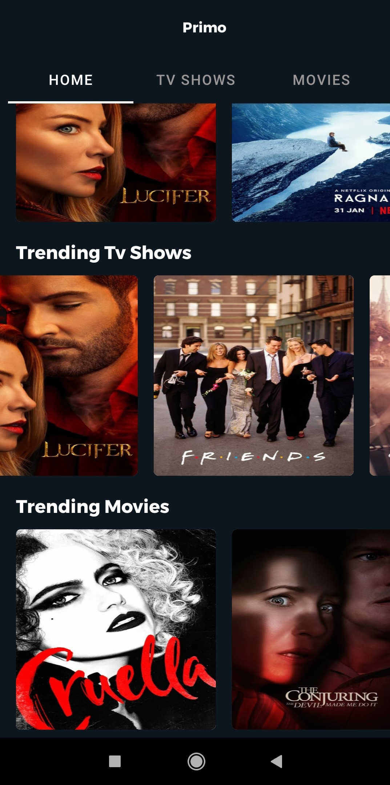
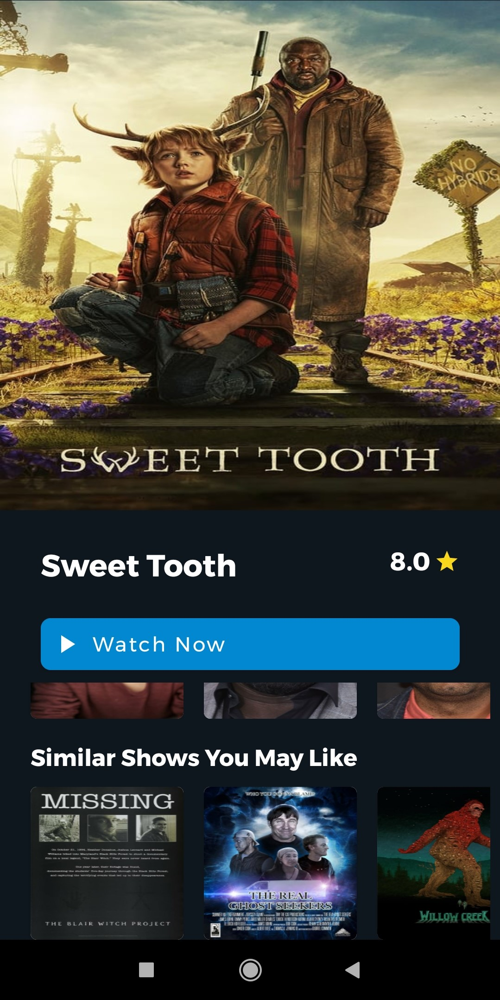
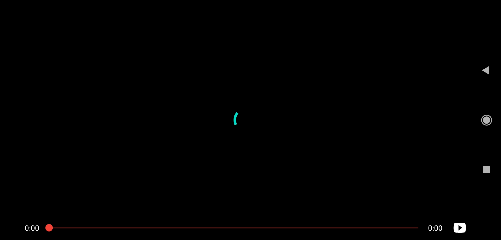

# Primo

Download the app from https://drive.google.com/file/d/1nHlxkTg6fM_4kWSVsHJzSiaiyCOi33tv/view

## About

An Android app to in which users can watch the trailer of movies and tv shows currently trending.

## Permission
On Android versions prior to Android 6.0, this Primo App requires the following permissions:
- Full Network Access.
- Run at startup.
- Read and write access to external storage.

## Libraries this app use
- Glide - https://github.com/bumptech/glide
- Exoplayer - https://github.com/google/ExoPlayer
- Android Youtube Player - https://github.com/PierfrancescoSoffritti/android-youtube-player

## Screenshots

